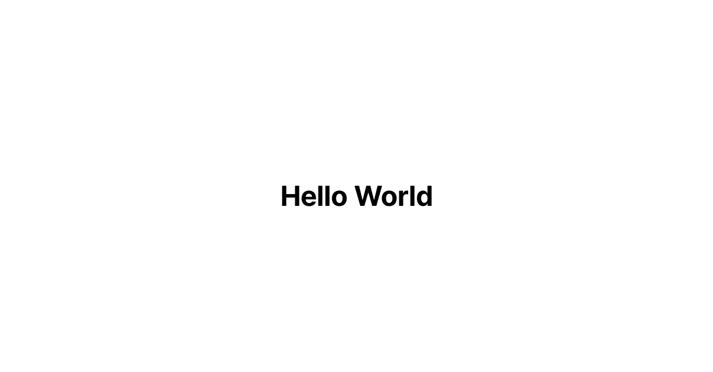
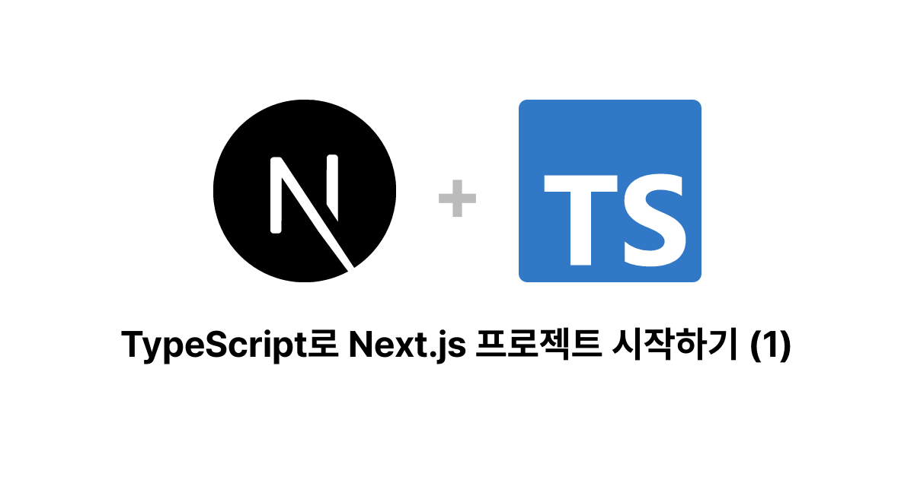
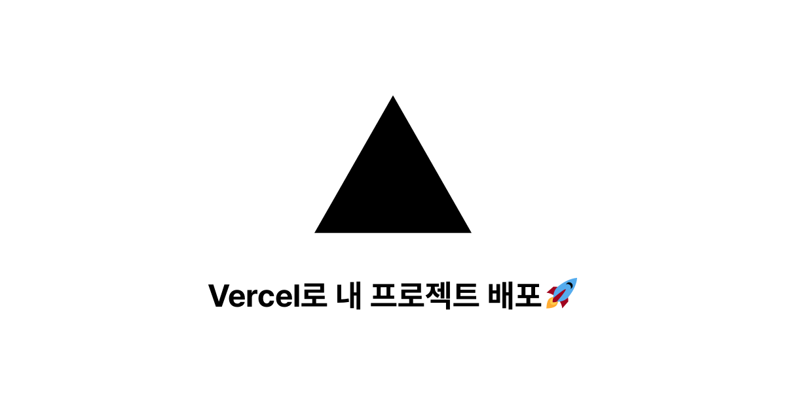

<h1>
  오픈그래프 API
  <a href="https://github.com/vercel/og-image" target="_blank">
    
  </a>
</h1>

Vercel사의 og-image 레파지토리를 블로그에서 사용하기 위해 커스터마이징 한 버전으로 자세한 설명은 [vercel/og-image][OG_IMAGE_LINK]를 참고하세요.

## [vercel/og-image][OG_IMAGE_LINK]와 다른점
1. hobby 요금제에서도 사용할 수 있게 `vercel.json` 설정 수정
2. 옵션 간소화
    * 항상 png로 리턴
    * 마크다운 지원 제거
    * `1200x627`로 고정
    * 이미지 추가 불가능
3. [Simple Icons][SIMPLE_ICONS] 으로 아이콘 표시
    * 사용 전 반드시 [Disclaimer][SIMPLE_ICONS_DISCLAIMER]를 읽어주세요.
4. 한국어 표시를 위해 [Pretendard][PRETENDARD]폰트로 대체

## 사용방법

## 일반적인 사용방법

```
https://opengraph-api-dungsil.vercel.app/api?text=Hello%20World
```

## 아이콘

```
https://opengraph-api-dungsil.vercel.app/api?text=TypeScript로 Next.js 프로젝트 시작하기 (1)&icons=next.js&icons=typescript
```

## 이모지

```
https://opengraph-api-dungsil.vercel.app/api?text=Vercel로 내 프로젝트 배포🚀&icons=vercel
```

## 배포
[](https://vercel.com/new/git/external?repository-url=https%3A%2F%2Fgithub.com%2Fdungsil%2Fopengraph-api)

## 라이선스
이 프로젝트의 소스코드는 [MIT License](./LICENSE)를 따릅니다.

### 크레딧
 - [vercel/og-image][OG_IMAGE_LINK] : MIT
 - [Hero Patterns][HERO_PATTERN] : CC-BY-4.0
 - [twitter/twemoji][TWEMOJI] : MIT (Code), CC-BY-4.0 (Graphic)
 - [simple-icons/simple-icons][SIMPLE_ICONS] : CC0-1.0 (Code)
 - [orioncactus/pretendard][PRETENDARD] : OFL-1.1 (Font)

<!-- 변수 -->
[OG_IMAGE_LINK]: https://github.com/vercel/og-image#readme
[SIMPLE_ICONS]: https://simpleicons.org/
[SIMPLE_ICONS_DISCLAIMER]: https://github.com/simple-icons/simple-icons/blob/develop/DISCLAIMER.md
[TWEMOJI]: https://github.com/twitter/twemoji/
[PRETENDARD]: https://github.com/orioncactus/pretendard
[HERO_PATTERN]: http://www.heropatterns.com/
